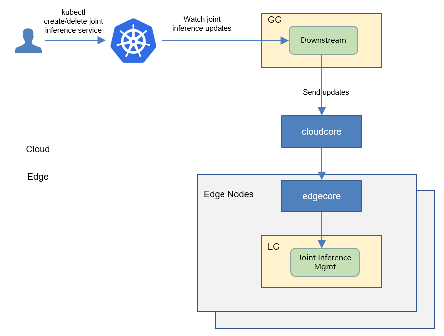
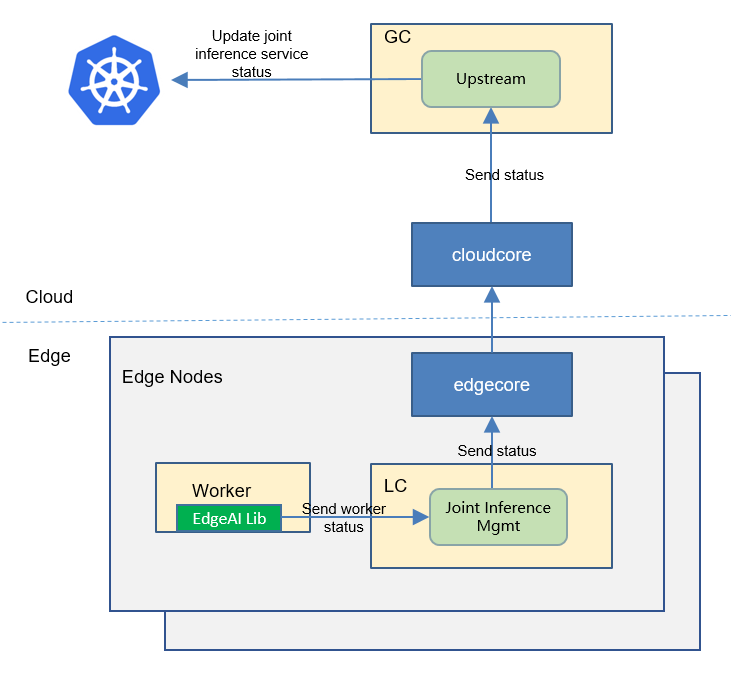
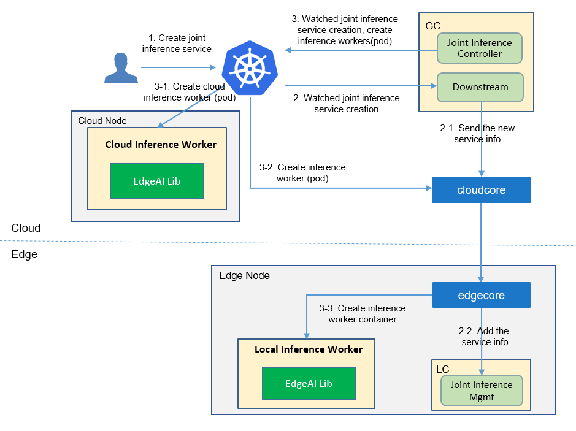
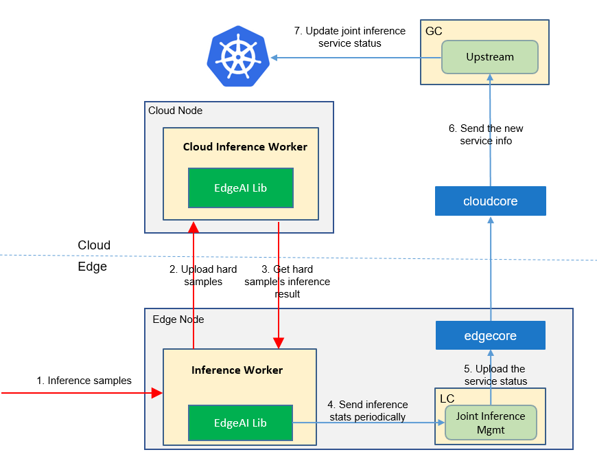

* [Joint Inference](#joint-inference)
   * [Motivation](#motivation)
     * [Goals](#goals)
     * [Non\-goals](#non-goals)
   * [Proposal](#proposal)
     * [Use Cases](#use-cases)
   * [Design Details](#design-details)
     * [CRD API Group and Version](#crd-api-group-and-version)
     * [Joint inference CRD](#joint-inference-crd)
     * [Joint inference type definition](#joint-inference-type-definition)
     * [Joint inference sample](#joint-inference-sample)
     * [Validation](#validation)
   * [Controller Design](#controller-design)
     * [Joint Inference Controller](#joint-inference-controller)
     * [Downstream Controller](#downstream-controller)
     * [Upstream Controller](#upstream-controller)
     * [Details of api between GM(cloud) and LC(edge)](#details-of-api-between-gmcloud-and-lcedge)
     * [Details of api between Worker(edge) and LC(edge)](#details-of-api-between-workeredge-and-lcedge)
     * [Flow of Joint Inference](#flow-of-joint-inference)
   * [Workers Communication](#workers-communication)
   
# Joint Inference
## Motivation

Inference on the edge can get a shorter latency and a higher throughput, and inference on the cloud can get better inference precision. 
The collaborative inference technology detects hard samples on the edge and sends them to the cloud for inference. 
**In this way, simple samples inference on the edge ensures latency and throughput, while hard samples inference on the cloud improves the overall precision.**


### Goals
* Joint inference improves the inference precision without significantly reducing the time and throughput.


## Proposal
We propose using Kubernetes Custom Resource Definitions (CRDs) to describe 
the joint inference specification/status and a controller to synchronize these updates between edge and cloud.


### Use Cases

* User can create a joint inference service with providing a training script,
 specifying the aggregation algorithm, configuring training hyper parameters, 
 configuring training datasets.

* Users can get the joint inference status, including the counts of inference at the edge/cloud.


## Design Details

### CRD API Group and Version
The `JointInferenceService` CRD will be namespace-scoped.
The tables below summarize the group, kind and API version details for the CRD.

* JointInferenceService

| Field                 | Description             |
|-----------------------|-------------------------|
|Group                  | neptune.io     |
|APIVersion             | v1alpha1                |
|Kind                   | JointInferenceService             |

### Joint inference CRD


Below is the CustomResourceDefinition yaml for `JointInferenceService`:

[crd source](/build/crds/neptune/jointinferenceservice_v1alpha1.yaml)

```yaml
apiVersion: apiextensions.k8s.io/v1
kind: CustomResourceDefinition
metadata:
  name: jointinferenceservices.neptune.io
spec:
  group: neptune.io
  names:
    kind: JointInferenceService
    plural: jointinferenceservices
    shortNames:
      - jointinferenceservice
      - jis
  scope: Namespaced
  versions:
    - name: v1alpha1
      subresources:
        # status enables the status subresource.
        status: {}
      served: true
      storage: true
      schema:
        openAPIV3Schema:
          type: object
          properties:
            spec:
              type: object
              required:
                - edgeWorker
                - cloudWorker
              properties:
                edgeWorker:
                  type: object
                  required:
                    - name
                    - model
                    - nodeName
                    - hardExampleAlgorithm
                    - workerSpec
                  properties:
                    name:
                      type: string
                    model:
                      type: object
                      required:
                        - name
                      properties:
                        name:
                          type: string
                    nodeName:
                      type: string
                    hardExampleAlgorithm:
                      type: object
                      required:
                        - name
                      properties:
                        name:
                          type: string
                    workerSpec:
                      type: object
                      required:
                        - scriptDir
                        - scriptBootFile
                        - frameworkType
                        - frameworkVersion
                      properties:
                        scriptDir:
                          type: string
                        scriptBootFile:
                          type: string
                        frameworkType:
                          type: string
                        frameworkVersion:
                          type: string
                        parameters:
                          type: array
                          items:
                            type: object
                            required:
                              - key
                              - value
                            properties:
                              key:
                                type: string
                              value:
                                type: string
                cloudWorker:
                  type: object
                  required:
                    - name
                    - model
                    - nodeName
                    - workerSpec
                  properties:
                    name:
                      type: string
                    model:
                      type: object
                      required:
                        - name
                      properties:
                        name:
                          type: string
                    nodeName:
                      type: string
                    workerSpec:
                      type: object
                      required:
                        - scriptDir
                        - scriptBootFile
                        - frameworkType
                        - frameworkVersion
                      properties:
                        scriptDir:
                          type: string
                        scriptBootFile:
                          type: string
                        frameworkType:
                          type: string
                        frameworkVersion:
                          type: string
                        parameters:
                          type: array
                          items:
                            type: object
                            required:
                              - key
                              - value
                            properties:
                              key:
                                type: string
                              value:
                                type: string
            status:
              type: object
              properties:
                conditions:
                  type: array
                  items:
                    type: object
                    properties:
                      type:
                        type: string
                      status:
                        type: string
                      lastHeartbeatTime:
                        type: string
                        format: date-time
                      lastTransitionTime:
                        type: string
                        format: date-time
                      reason:
                        type: string
                      message:
                        type: string
                startTime:
                  type: string
                  format: date-time
                active:
                  type: integer
                failed:
                  type: integer
                metrics:
                  type: array
                  items:
                    type: object
                    properties:
                      key:
                        type: string
                      value:
                        type: string


      additionalPrinterColumns:
        - name: status
          type: string
          description: The status of the jointinference service
          jsonPath: ".status.conditions[-1].type"
        - name: active
          type: integer
          description: The number of active worker
          jsonPath: ".status.active"
        - name: failed
          type: integer
          description: The number of failed worker
          jsonPath: ".status.failed"
        - name: Age
          type: date
          jsonPath: .metadata.creationTimestamp

```

### Joint inference type definition

[go source](cloud/pkg/apis/neptune/v1alpha1/jointinferenceservice_types.go)

```go
package v1alpha1

import (
	v1 "k8s.io/api/core/v1"
	metav1 "k8s.io/apimachinery/pkg/apis/meta/v1"
)

// +genclient
// +k8s:deepcopy-gen:interfaces=k8s.io/apimachinery/pkg/runtime.Object
// JointInferenceService describes the data that a jointinferenceservice resource should have
type JointInferenceService struct {
	metav1.TypeMeta `json:",inline"`

	metav1.ObjectMeta `json:"metadata"`

	Spec   JointInferenceServiceSpec   `json:"spec"`
	Status JointInferenceServiceStatus `json:"status,omitempty"`
}

// JointInferenceServiceSpec is a description of a jointinferenceservice
type JointInferenceServiceSpec struct {
	EdgeWorker  EdgeWorker  `json:"edgeWorker"`
	CloudWorker CloudWorker `json:"cloudWorker"`
}

// EdgeWorker describes the data a edge worker should have
type EdgeWorker struct {
	Name                 string               `json:"name"`
	Model                SmallModel           `json:"model"`
	NodeName             string               `json:"nodeName"`
	HardExampleAlgorithm HardExampleAlgorithm `json:"hardExampleAlgorithm"`
	WorkerSpec           CommonWorkerSpec     `json:"workerSpec"`
}

// CloudWorker describes the data a cloud worker should have
type CloudWorker struct {
	Name       string           `json:"name"`
	Model      BigModel         `json:"model"`
	NodeName   string           `json:"nodeName"`
	WorkerSpec CommonWorkerSpec `json:"workerSpec"`
}

type SmallModel struct {
	Name string `json:"name"`
}

type BigModel struct {
	Name string `json:"name"`
}

type HardExampleAlgorithm struct {
	Name string `json:"name"`
}

// +k8s:deepcopy-gen:interfaces=k8s.io/apimachinery/pkg/runtime.Object

// JointInferenceServiceList is a list of JointInferenceServices.
type JointInferenceServiceList struct {
	metav1.TypeMeta `json:",inline"`
	metav1.ListMeta `json:"metadata"`
	Items           []JointInferenceService `json:"items"`
}

// JointInferenceServiceStatus represents the current state of a joint inference service.
type JointInferenceServiceStatus struct {

	// The latest available observations of a joint inference service's current state.
	// +optional
	Conditions []JointInferenceServiceCondition `json:"conditions,omitempty"`

	// Represents time when the service was acknowledged by the service controller.
	// It is not guaranteed to be set in happens-before order across separate operations.
	// It is represented in RFC3339 form and is in UTC.
	// +optional
	StartTime *metav1.Time `json:"startTime,omitempty"`

	// The number of actively running workers.
	// +optional
	Active int32 `json:"active"`

	// The number of workers which reached to Failed.
	// +optional
	Failed int32 `json:"failed"`

	// Metrics of the joint inference service.
	Metrics []Metric `json:"metrics,omitempty"`
}

type JointInferenceServiceConditionType string

// These are valid conditions of a service.
const (
	// JointInferenceServiceCondPending means the service has been accepted by the system,
	// but one or more of the workers has not been started.
	JointInferenceServiceCondPending JointInferenceServiceConditionType = "Pending"
	// JointInferenceServiceCondFailed means the service has failed its execution.
	JointInferenceServiceCondFailed JointInferenceServiceConditionType = "Failed"
	// JointInferenceServiceReady means the service has been ready.
	JointInferenceServiceCondRunning JointInferenceServiceConditionType = "Running"
)

// JointInferenceServiceCondition describes current state of a service.
type JointInferenceServiceCondition struct {
	// Type of service condition, Complete or Failed.
	Type JointInferenceServiceConditionType `json:"type"`
	// Status of the condition, one of True, False, Unknown.
	Status v1.ConditionStatus `json:"status"`
	// Last time the condition was checked.
	// +optional
	LastHeartbeatTime metav1.Time `json:"lastHeartbeatTime,omitempty"`
	// Last time the condition transit from one status to another.
	// +optional
	LastTransitionTime metav1.Time `json:"lastTransitionTime,omitempty"`
	// (brief) reason for the condition's last transition.
	// +optional
	Reason string `json:"reason,omitempty"`
	// Human readable message indicating details about last transition.
	// +optional
	Message string `json:"message,omitempty"`
}

```

#### Validation
[Open API v3 Schema based validation](https://kubernetes.io/docs/tasks/access-kubernetes-api/custom-resources/custom-resource-definitions/#validation) can be used to guard against bad requests.
Invalid values for fields ( example string value for a boolean field etc) can be validated using this.

Here is a list of validations we need to support :
1. The `dataset` specified in the crd should exist in k8s.
1. The `model` specified in the crd should exist in k8s.
1. The edgenode name specified in the crd should exist in k8s.

### joint inference sample
```yaml
apiVersion: neptune.io/v1alpha1
kind: JointInferenceService
metadata:
  name: helmet-detection-demo
  namespace: default
spec:
  edgeWorker:
    name: "edgeworker"
    model:
      name: "small-model"
    nodeName: "edge0"
    hardExampleAlgorithm:
      name: "IBT"
    workerSpec:
      scriptDir: "/code"
      scriptBootFile: "edge_inference.py"
      frameworkType: "tensorflow"
      frameworkVersion: "1.18"
      parameters:
        - key: "nms_threshold"
          value: "0.6"
  cloudWorker:
    name: "work"
    model:
      name: "big-model"
    nodeName: "solar-corona-cloud"
    workerSpec:
      scriptDir: "/code"
      scriptBootFile: "cloud_inference.py"
      frameworkType: "tensorflow"
      frameworkVersion: "1.18"
      parameters:
        - key: "nms_threshold"
          value: "0.6"
```

## Controller Design
The joint inference controller starts three separate goroutines called `upstream`, `downstream` and `joint-inference`controller. These are not separate controllers as such but named here for clarity.
- joint inference: watch the updates of joint-inference-task crds, and create the workers to complete the task.
- downstream: synchronize the joint-inference updates from the cloud to the edge node.
- upstream: synchronize the joint-inference updates from the edge to the cloud node.

### Joint Inference Controller


The joint-inference controller watches for the updates of joint-inference tasks and the corresponding pods against the K8S API server.
Updates are categorized below along with the possible actions:

| Update Type                    | Action                                       |
|-------------------------------|---------------------------------------------- |
|New  Joint-inference-service Created             |Create the cloud/edge worker|
|Joint-inference-service Deleted                 | NA. These workers will be deleted by GM.|
|The corresponding pod created/running/completed/failed                 | Update the status of joint-inference task.|


### Downstream Controller


The downstream controller watches for joint-inference updates against the K8S API server.
Updates are categorized below along with the possible actions that the downstream controller can take:

| Update Type                    | Action                                       |
|-------------------------------|---------------------------------------------- |
|New Joint-inference-service Created             |Sends the task information to LCs.|
|Joint-inference-service Deleted                 | The controller sends the delete event to LCs.|

### Upstream Controller


The upstream controller watches for joint-inference-task updates from the edge node and applies these updates against the API server in the cloud.
Updates are categorized below along with the possible actions that the upstream controller can take:

| Update Type                        | Action                                        |
|-------------------------------     |---------------------------------------------- |
|Joint-inference-service Reported State Updated    |  The controller appends the reported status of the Joint-inference-service in the cloud. |

### Details of api between GM(cloud) and LC(edge)
1. GM(downstream controller) syncs the task info to LC:
    ```go
    // POST <namespace>/neptune/downstream/jointinferenceservices/<name>/insert
    // body same to the task crd of k8s api, omitted here.
    ```

1. LC uploads the task status which reported by the worker to GM(upstream controller):
    ```go
    // POST <namespace>/neptune/upstream/jointinferenceservices/<name>/status
       
    // JoinInferenceServiceStatus defines status that send to GlobalManager
    type JoinInferenceServiceStatus struct {
    	Phase  string  `json:"phase"`
    	Status string  `json:"status"`
    	Output *Output `json:"output"`
    }
    
    // Output defines task output information
    type Output struct {
    	Models   []Model   `json:"models"`
    	TaskInfo *TaskInfo `json:"taskInfo"`
    }
    
    // Model defines the model information
    type Model struct {
    	Format string `json:"format"`
    	URL    string `json:"url"`
    }
    
    // TaskInfo defines the task information
    type TaskInfo struct {
    	InferenceNumber   int     `json:"inferenceNumber"`
    	HardExampleNumber int     `json:"hardExampleNumber"`
    	UploadCloudRatio  float64 `json:"uploadCloudRatio"`
    	StartTime         string  `json:"startTime"`
    	CurrentTime       string  `json:"currentTime"`
    }

    ```

### Details of api between Worker(edge) and LC(edge)
1. Worker sends inference info to LC in same edge node:

    ```
    // POST /neptune/workers/<worker-name>/info
    ```
 
    ```json
   {
       "name": "worker-name",
       "namespace": "default",
       "ownerName": "jointinferenceservice-name",
       "ownerKind": "jointinferenceservice",
       "kind": "inference",
       "status": "completed/failed/running",
       "taskInfo": {
           "inferenceNumber": 1000,
           "hardExampleNumber": 100,
           "uploadCloudRatio": 0.1,
           "startTime": "2020-11-03T08:39:22.517Z",
           "updateTime": "2020-11-03T08:50:22.517Z"
       }
   }
   ```


### Flow of Joint Inference
- The flow of joint inference service creation:



## Workers Communication


